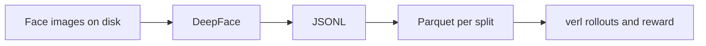

# Dataset for VLM + RL (this repo)

This document describes the **artificial training data** produced by the Dumbledore pipeline: face images, **pseudo–ground truth** from [DeepFace](https://github.com/serengil/deepface), and **verl**-ready Parquet used when you post-train a **vision–language model** (VLM) such as Gemma 4 with reinforcement learning. The “labels” are **not** human annotations; they are **whatever DeepFace returns** for each image, under the settings in [`configs/pipeline.example.yaml`](configs/pipeline.example.yaml).

## Ground truth vs VLM input (read this first)

**Building GT (offline, teacher stack):** each **sample** is one image file. DeepFace runs an internal **face detector** (e.g. OpenCV / MTCNN per your `detector_backend`), then **recognition** on the crop (Facenet512 embedding) and **attribute** heads (`analyze`). Conceptually:

```text
dataset  -->  one sample  -->  [ detector  -->  face box / align  ]  -->  [ recognition: embed + attributes ]
   |              |                        |
   +-- image file on disk (full frame)      +-- GT string encodes only recognition outputs, not the box
```

**Training the VLM (student):** the model does **not** use DeepFace’s detector. The VLM is fed the **entire image file** at `image_path` (as loaded by your verl / processor, typically resize/patch the **whole** frame, not a DeepFace export crop). The **reward** still compares the model’s text output to the same pseudo-GT JSON. So:

- The dataset is **suitable for whole-image VLM** because `extra_info` includes `image_path` to that **full** file and `whole_image: true` (see Parquet below).
- **Alignment** between GT and vision is: “this file produced this DeepFace output.” The student must learn from full context; scenes with tiny/occluded faces are harder and may not match the teacher’s assumptions.

**Practical tips:** prefer images where a single face is clearly present if you want attribute GT to be meaningful; the VLM still sees the **full** image, not a detector crop.

## Stages: ASCII overview

**Pipeline stages (files on disk, up to verl):**

```text
+-------------+     +------------------+     +-----------+     +----------------------+     +------------------+
|   Images    | --> |  extract_        | --> |  gt.jsonl | --> |  build_verl_         | --> | train/val/       |
|  directory  |     |  deepface_gt.py  |     | (per line) |     |  parquet.py          |     | test .parquet    |
+-------------+     +------------------+     +-----------+     +----------------------+     +------------------+
  raw_image.*          DeepFace per file        path +            prompt + ground_truth         ready for
                       writes GT string          ground_truth      + extra_info (path)         verl + VLM loader
```

**What happens inside GT extraction (teacher only, not the VLM):**

```text
  sample = one image file (path stored in row)
         |
         v
  +------------------+
  | DeepFace: detect |  (internal detector_backend; not repeated in VLM)
  +------------------+
         |
         v
  +------------------+     +-------------------------+
  | represent()      |     | analyze()  (if enabled) |
  | (e.g. Facenet512) |   | age, gender, ...        |
  +------------------+     +-------------------------+
         |                            |
         +---------> serialize DeepFaceGTV1 JSON into ground_truth
```

**VLM + RL (student):**

```text
  train.parquet row
         |
         v
  load image_path  --------->  [ VLM: full image tensor  +  tokenized prompt  ]
  (whole file; NOT                     |
   DeepFace crop)                     v
                               generated JSON string
                                     |
                                     v
                         compute_score(solution, ground_truth)
```

## End-to-end flow (narrative)

1. **Images** — Local folder of image files (e.g. from [`scripts/download_face_subset.py`](scripts/download_face_subset.py) or your own data).
2. **DeepFace** — For each file: internal **detector** + **recognition** / `analyze` per config; output serialized as one GT string.
3. **JSONL** — One line per success with `image_path` and `ground_truth`.
4. **Parquet** — Splits: each row has **text** `prompt`, string `ground_truth`, and `extra_info` with **`image_path` (full file)** and **`whole_image: true`** so dataloaders load the same file as the full-frame VLM input.
5. **verl** — Rollout + reward; VLM conditions on **whole image** + text, not on DeepFace’s internal crop.



## Ground truth: `DeepFaceGTV1` (JSON, schema version 1.0)

Stored as a **single JSON string** in `ground_truth` (sorted keys when serialized in code). Logical fields:

| Field | Meaning |
|--------|--------|
| `schema_version` | Always `"1.0"` in this project. |
| `image_path` | Absolute (or as produced) path to the image file. |
| `facenet512` | Either a **list of 512 floats** (when `include_facenet512: true`) or an **empty list** (when off). |
| `analyze` | Object with a subset of: `age` (int), `gender` / `emotion` / `race` (strings, dominant labels from DeepFace). Only **enabled** attributes from config appear. |
| `deepface_metadata` | Optional: model name, detector, list of `actions` used, etc. |

**Pseudo-GT** means: the “correct answer” in RL is **this JSON**, not a human-annotated benchmark. The reward in [`rewards/face_attr_reward.py`](rewards/face_attr_reward.py) scores how well the model’s **decoded text** (expected to be the same JSON shape) matches this string—schema match, optional embedding cosine, optional attribute match.

**Ethics and quality:** face attributes and demographics are sensitive; DeepFace is imperfect and biased. Use data you are allowed to process and treat metrics as **best-effort** with respect to this automated supervisor.

## Intermediate format: `gt.jsonl`

Each line is a JSON object, for example:

```json
{
  "image_path": "/abs/path/to/face_0000.png",
  "ground_truth": "{...one DeepFaceGTV1 string...}",
  "ok": true
}
```

Produced by [`scripts/extract_deepface_gt.py`](scripts/extract_deepface_gt.py). Failures are optional lines in a log file, not in this JSONL.

## Verl / VLM format: `train.parquet`, `val.parquet`, `test.parquet`

Built by [`scripts/build_verl_parquet.py`](scripts/build_verl_parquet.py) under `data.parquet_dir` (default `data/verl/`). **Columns** (per row, one per image / sample):

| Column | Type (conceptual) | Role |
|--------|-------------------|------|
| `data_source` | string | E.g. `deepface_face_attr`; for filtering in multi-task setups. |
| `prompt` | string | System + user text: what the model should do (output **one** JSON object with `schema_version`, `facenet512` / `analyze` / `image_path` as configured). This is **text**; the **image** is not bytes inside this column. |
| `ability` | string | E.g. `face_attr_json`. |
| `ground_truth` | string | The same canonical JSON as in JSONL—used as the **verifiable target** in `compute_score`. |
| `extra_info` | string (JSON) | Metadata: `image_id` (hashed id), `image_path` (path to the **entire** image file on disk), `modality: "text_or_vlm"`, **`whole_image: true`** (VLM should load the **full** file, not a face crop or DeepFace-aligned crop), `analyze_keys`, `include_facenet512`. A **VLM dataloader in verl** should open `image_path` as the **whole-image** input to the vision encoder. |

**Important for VLM:** **multimodal training** = **(full image from `image_path`, `prompt` text) → model generates a string** compared to `ground_truth` by the custom reward. The student never receives DeepFace’s internal bounding box—only the same **full** image file the teacher ran on. How **verl** ingests `extra_info` and loads pixels is **version-specific**; your recipe should **not** crop to a face first unless you change this contract on purpose. `ground_truth["image_path"]` inside the JSON is the same path string, for self-consistency in the text target.

**Splits** — By default, rows are shuffled (fixed `seed`) and split by `train_ratio` / `val_ratio`; the remainder is `test`. If the train split would be empty, the build script can put all rows in train and warn.

## How this connects to RL

- **Policy** — Typically a VLM (e.g. `hf_model_id` in pipeline YAML) produces **one continuation** (string) per **(prompt [+ image])**.
- **Reward** — [`compute_score(data_source, solution_str, ground_truth, extra_info)`](rewards/face_attr_reward.py) parses `solution_str` as JSON, compares to `ground_truth` (weights apply only to terms present in GT, e.g. no embedding block means no embedding weight in the sum).
- **verl** — Algorithm (GRPO, PPO, …) and trainer config are **not** in this dataset; they come from your installed [verl](https://github.com/verl-project/verl) and are merged with paths from [`scripts/verl_config_helper.py`](scripts/verl_config_helper.py) / [`configs/pipeline.example.yaml`](configs/pipeline.example.yaml).

## Controlling the dataset: `pipeline.example.yaml`

Copy to `configs/pipeline.yaml` (often gitignored). The important knobs for *what* gets generated:

- `hf_model_id` — Trained model id (independent of the Parquet schema; used for launch/SFT).
- `deepface.attributes.*` — Turn each of `age`, `gender`, `emotion`, `race` **on** or **off** for `analyze` in GT and in the user part of `prompt`.
- `deepface.include_facenet512` — Whether the 512-d vector is in GT and required in the prompt.
- `data.*` — Paths, `num_images` cap, split ratios, `seed`.

## Quick reference: files

| Artifact | Path (defaults) | Purpose |
|----------|-----------------|--------|
| Config | `configs/pipeline.example.yaml` | What to extract and where to write. |
| Raw images | `data/raw_images/` (typical) | Input to DeepFace. |
| JSONL | `data/gt.jsonl` | One sample per line, GT strings. |
| Parquet | `data/verl/train|val|test.parquet` | verl + VLM integration. |
| JSON schema (reference) | `schema/gt_v1.json` | Shape of GT object. |

## Further reading

- [README](README.md) — Commands and setup.
- [configs/verl/README.md](configs/verl/README.md) — Merging with verl examples.
- [docs/EXPORT_LITERT.md](docs/EXPORT_LITERT.md) — After RL, export to LiteRT (separate from this dataset story).
