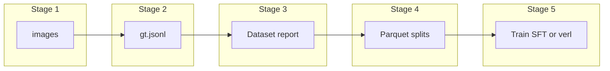

<p align="center">
  
</p>

<h1 align="center">Dumbledore</h1>

<p align="center">
  <strong>Images → teacher pseudo–ground truth → line-oriented export → dataset report → columnar splits → VLM training (e.g. supervised fine-tuning and/or <a href="https://github.com/verl-project/verl">verl</a>).</strong>
</p>

---

## Overview

This repo is a **config-driven pipeline** from a directory of **images** to **training rows** for a **vision–language model (VLM)**. For each image, a **teacher** model writes a **pseudo–ground truth** string (no human labels required): whatever structured prediction you configure is serialized into `ground_truth`, paired with a text `prompt` and full-frame `image_path` metadata. The **default** teacher integration is **[DeepFace](https://github.com/serengil/deepface)** (detector + representation + optional `analyze` heads); the overall shape is **image → pseudo–GT → JSONL → report → Parquet**. Outputs target **[verl](https://github.com/verl-project/verl)** (`compute_score` reward) and similar trainers; the **Hugging Face model id** in config is the student checkpoint you train (see `configs/` for examples). Optional **LiteRT** export after training: [docs/EXPORT_LITERT.md](docs/EXPORT_LITERT.md).

**Ethics:** use only data you may process; minimize sensitive attributes in YAML when you can.

---

## Why this order: JSONL, report, then Parquet

1. **JSONL** — One JSON object per line: cheap to write incrementally, easy to **grep**, stream, or re-run extraction without rebuilding a whole table. It is the **canonical intermediate** between image processing and training-format export.
2. **Dataset report (QC)** — Summaries and checks on that JSONL (and optionally on Parquet after splits) catch **bad rows, schema drift, and split skew** before you freeze **train/val/test** files. Fixing extraction and re-reporting is simpler than debugging training on a bad table.
3. **Parquet** — **Columnar**, **typed**, and convenient for **sharded train/val/test** and dataloaders. The pipeline treats Parquet as the **artifact you train on**, not the scratch format during extraction.

So the order is **extract → inspect → materialize splits**, not an arbitrary choice.

---

## What you get

| Artifact | Role |
| --- | --- |
| **JSONL** | One line per sample: `image_path` + stringified `ground_truth` (pseudo–GT from the teacher) |
| **Dataset report** | Stats and QC on JSONL (re-runnable after Parquet for split-aware stats) |
| **Parquet splits** | `prompt`, `ground_truth`, `extra_info` (incl. full-frame `image_path`) for training |
| **Reward** | [`rewards/face_attr_reward.py`](rewards/face_attr_reward.py) — `compute_score` for RL setups that use it |

Data semantics and schema details: **[DATA.md](DATA.md)**.

---

## Pipeline stages (one script per step)

**`scripts/`** contains **only** shell (`.sh`). Python CLIs live under [`dumbledore/cli/`](dumbledore/cli/) and are invoked with `python -m dumbledore.cli.<module>`; the `run_stage*.sh` helpers do that for you.

From the **repo root**, with your venv activated, run the numbered `scripts/run_stageN_*.sh` scripts in order. They `cd` to the repo, set `PYTHONPATH`, and point at a pipeline config:

- If **`configs/pipeline.yaml` exists**, it is used.
- Otherwise the scripts fall back to **`configs/pipeline.example.yaml`**.
- To pick a file explicitly: `CONFIG=/path/to/pipeline.yaml ./scripts/run_stage2_extract.sh`  
  (or a path relative to the repo, e.g. `CONFIG=configs/pipeline.yaml`).
- **Example templates** in `configs/`: `pipeline.example.yaml` / `pipeline.lfw.example.yaml` (LFW, **`deepface.ground_truth.bbox: false`**), `pipeline.wider.example.yaml` (WIDER FACE, **`bbox: true`**, full-scene-oriented `prompt`).

| Stage | Script (exact entry point) | What it runs |
| --- | --- | --- |
| **0. Config** | `./scripts/run_stage0_config.sh` | Creates `configs/pipeline.yaml` from the example if missing (`--force` to overwrite) |
| **1. Images** *(skip if you already have a folder)* | `./scripts/run_stage1_images.sh` | [`dumbledore/cli/download_face_subset.py`](dumbledore/cli/download_face_subset.py) — optional download of **sample** image sets → `data.raw_dir` (examples in config: **LFW** via scikit-learn, **WIDER FACE** via Hugging Face streaming; set `dataset.name` in YAML) |
| **2. Extract** | `./scripts/run_stage2_extract.sh` | [`dumbledore/cli/extract_deepface_gt.py`](dumbledore/cli/extract_deepface_gt.py) — teacher pseudo–GT → JSONL (default teacher: DeepFace) |
| **3. Report** | `./scripts/run_stage3_report.sh` | [`dumbledore/cli/dataset_report.py`](dumbledore/cli/dataset_report.py) — `report.json` + optional PNGs (JSONL first; re-run after stage 4 to add Parquet stats) |
| **4. Parquet** | `./scripts/run_stage4_parquet.sh` | [`dumbledore/cli/build_verl_parquet.py`](dumbledore/cli/build_verl_parquet.py) — JSONL → train/val/test Parquet |
| **5a. SFT** *(optional)* | `./scripts/run_stage5_sft.sh` | [`dumbledore/cli/sft_coldstart.py`](dumbledore/cli/sft_coldstart.py) — LoRA on `train.parquet` |
| **5b. verl hints** | `./scripts/run_stage5_verl.sh` | [`dumbledore/cli/verl_config.py`](dumbledore/cli/verl_config.py) — prints exports + Hydra lines (verl is **not** installed here) |

**Order:** after **JSONL** exists, run **stage 3 (report)**, then **stage 4 (Parquet)**, then training. Rationale: [Why this order](#why-this-order-jsonl-report-then-parquet). You can **run `run_stage3_report.sh` again** after stage 4 so the report includes split Parquet stats.

Shared resolution logic lives in [scripts/pipeline_env.sh](scripts/pipeline_env.sh).

Data flow: **images** → `data/gt.jsonl` → **report (stage 3)** → `data/verl/*.parquet` (stage 4) → **training**. Paths default from `data.*` in the YAML ([DATA.md](DATA.md)). **Training rows:** `prompt` = text request, `extra_info["image_path"]` = path to the **full image** for the vision stack, `ground_truth` = **pseudo–GT** string for scoring (e.g. reward).



### Quick reference: flags you might pass

- **Stage 1–4:** all forward extra args to the Python script (e.g. `--max-images`, `--max-rows 100`, `--no-viz`).
- **Stage 3 (report):** default output is `reports/latest`; set `REPORT_DIR` or add `--out /other/dir` (if you use `--out` on the command line, it overrides `REPORT_DIR`).

**Low-level (same as the shell wrappers):** e.g. `python -m dumbledore.cli.extract_deepface_gt --config configs/pipeline.yaml` from the repo root after `pip install -e .`; the `run_stage*.sh` scripts are the supported interface.

**Stage 2** uses the **default** teacher (**DeepFace**, TensorFlow-backed) — see [Setup](#setup). For stage 3 report figures: `pip install -e ".[report]"` (**pandas** + **pyarrow** are in the main deps).

---

## End-to-end example (config-driven)

```bash
cd dumbledore
# . .venv/bin/activate   # if you use a venv

./scripts/run_stage0_config.sh
# edit configs/pipeline.yaml (hf_model_id, teacher / deepface, data.*)

./scripts/run_stage1_images.sh
./scripts/run_stage2_extract.sh
./scripts/run_stage3_report.sh
./scripts/run_stage4_parquet.sh --max-rows 100
# optional: ./scripts/run_stage3_report.sh  # again, to add train/val/test Parquet stats to report.json
./scripts/run_stage5_verl.sh
# then start verl with the printed Hydra overrides; optionally ./scripts/run_stage5_sft.sh first
```

## Without the downloader (your own image tree)

```bash
./scripts/run_stage2_extract.sh --image-dir /path/to/images --out data/gt.jsonl --max-images 100
./scripts/run_stage3_report.sh --jsonl data/gt.jsonl
./scripts/run_stage4_parquet.sh --jsonl data/gt.jsonl --out-dir data/verl
# optional: ./scripts/run_stage3_report.sh --jsonl data/gt.jsonl --parquet-dir data/verl
```

(When you use `--config`, `run_stage4_parquet.sh` and `run_stage2_extract.sh` also load splits and model settings from the YAML.)

## Config fragments

- [configs/grpo_gemma4_e2b.example.yaml](configs/grpo_gemma4_e2b.example.yaml) — example **verl** Hydra merge snippet; **pipeline YAML** remains the source of truth for paths, teacher settings, and prompts.

## Optional: LiteRT export

[docs/EXPORT_LITERT.md](docs/EXPORT_LITERT.md)

## Setup

```bash
cd dumbledore
python -m venv .venv && . .venv/bin/activate
pip install -e .
pip install -e ".[lfw]"   # LFW image download (stage 1; sklearn + SciPy)
pip install -e ".[wider]" # WIDER FACE subset (Hub streaming; `datasets` 2.x; non-commercial license)
pip install -r requirements.txt
# DeepFace: pip install -e ".[face]"   # includes TensorFlow + **torch** (torch is required if `is_real` is true in YAML)
# Report figures: pip install -e ".[report]"
```

With `.venv` present, `run_stage1_images.sh` / `run_stage2_*.sh` **prepend** `.venv/bin` to `PATH` (see [scripts/pipeline_env.sh](scripts/pipeline_env.sh)) so the download uses the venv’s Python, not a broken system Anaconda.

**Stages (order):** `run_stage0_config.sh` → `run_stage1_images.sh` (optional fetch) → `run_stage2_extract.sh` (pseudo–GT → JSONL) → `run_stage3_report.sh` → `run_stage4_parquet.sh` → `verl_config` / `run_stage5_verl.sh` (verl is external). `PIPELINE_CONFIG` / `CONFIG` default to `configs/pipeline.yaml` or the example; override with `CONFIG=path ./scripts/run_stage2_extract.sh …`.

**Environment issues:** If `pandas` / `sklearn` / `numexpr` print `_ARRAY_API` or fail to import with **NumPy 2.x**, upgrade `pyarrow`, `numexpr`, and `bottleneck` to current wheels (`pip install -U pyarrow numexpr bottleneck`) or use a venv and `pip install -r requirements.txt` so binaries match. Stage 1 (LFW) needs **scikit-learn** with a matching **NumPy/SciPy** stack; if the downloader fails, point stage 2 at an existing folder: `./scripts/run_stage2_extract.sh --image-dir /path/to/images --out data/gt.jsonl`. Stage 2 (default DeepFace teacher) needs **TensorFlow** + `deepface` (see `pip install -e ".[face]"` and `requirements.txt`).

## Tests

```bash
pytest
# or: PYTHONPATH=. python -m pytest
```

## Layout

- [DATA.md](DATA.md) — dataset format, teacher vs VLM, Parquet / `extra_info`
- [dumbledore/pipeline_config.py](dumbledore/pipeline_config.py) — load master YAML
- [scripts/pipeline_env.sh](scripts/pipeline_env.sh) — `PIPELINE_CONFIG` / `CONFIG` for all `run_stage*.sh` scripts
- [dumbledore/paths.py](dumbledore/paths.py) — `REPO_ROOT` for CLIs
- [dumbledore/cli/](dumbledore/cli/) — pipeline CLIs (`python -m dumbledore.cli.…`)
- [dumbledore/dataset_report.py](dumbledore/dataset_report.py) — `analyze_jsonl` / `analyze_parquet_dir` (library; CLI is `dumbledore.cli.dataset_report`)
- [dumbledore/face_attr_domains.py](dumbledore/face_attr_domains.py) — allowed strings/ranges for bbox/age/gender/emotion/race in prompts and pseudo–GT when using the DeepFace teacher (`dominant_*`)
- [dumbledore/prompts.py](dumbledore/prompts.py) — `build_training_prompt` (YAML `prompt` + `deepface.ground_truth` → `prompt` column / JSONL)
- [dumbledore/gt_schema.py](dumbledore/gt_schema.py) — `build_user_prompt` + `build_indexed_ground_truth_string`
- [dumbledore/deepface_ops.py](dumbledore/deepface_ops.py) — normalize DeepFace outputs
- [dumbledore/gt_inspect.py](dumbledore/gt_inspect.py) — parse / summarize ground-truth JSON
- [rewards/face_attr_reward.py](rewards/face_attr_reward.py) — `compute_score` for verl
- [schema/gt_sample.json](schema/gt_sample.json) — example `ground_truth` object (stringified in JSONL/Parquet rows)
